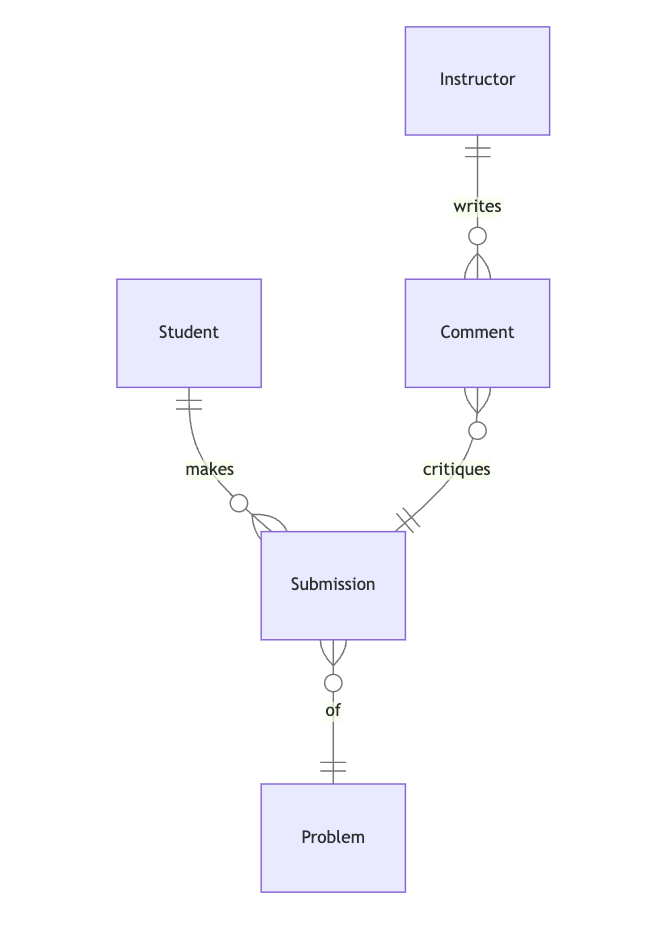

# Documento de Diseño

Por Carter Zenke

Video resumen: (Normalmente aquí habría una URL, ¡pero no para esta tarea de muestra!)

## Alcance

La base de datos para el proyecto incluye todas las entidades necesarias para facilitar el proceso de seguimiento del progreso de los estudiantes y dejar comentarios sobre el trabajo de los estudiantes. Como tal, se incluye en el alcance de la base de datos:

* Estudiantes, incluyendo información básica de identificación
* Instructores, incluyendo información básica de identificación
* Entregas de estudiantes, incluyendo el momento en que se realizó la entrega, la puntuación de corrección que recibió y el problema al que está relacionada la entrega
* Problemas, que incluye información básica sobre los problemas del curso
* Comentarios de los instructores, incluyendo el contenido del comentario y la entrega sobre la que se dejó el comentario

Quedan fuera del alcance elementos como certificados, calificaciones finales y otros atributos no esenciales.

## Requisitos Funcionales

Esta base de datos soportará:

* Operaciones CRUD para estudiantes e instructores
* Seguimiento de todas las versiones de las entregas de los estudiantes, incluyendo múltiples entregas para el mismo problema
* Agregar múltiples comentarios a una entrega de un estudiante por parte de los instructores

Tengan en cuenta que en esta iteración, el sistema no soportará que los estudiantes respondan a los comentarios.

## Representación

Las entidades se capturan en tablas de SQLite con el siguiente esquema.

### Entidades

La base de datos incluye las siguientes entidades:

#### Estudiantes

La tabla `students` incluye:

* `id`, que especifica el ID único para el estudiante como un `INTEGER`. A esta columna se le aplica la restricción `PRIMARY KEY`.
* `first_name`, que especifica el nombre del estudiante como `TEXT`, dado que `TEXT` es apropiado para campos de nombre.
* `last_name`, que especifica el apellido del estudiante. Se usa `TEXT` por la misma razón que `first_name`.
* `github_username`, que especifica el nombre de usuario de GitHub del estudiante. Se usa `TEXT` por la misma razón que `first_name`. Una restricción `UNIQUE` asegura que no haya dos estudiantes con el mismo nombre de usuario de GitHub.
* `started`, que especifica cuándo comenzó el estudiante el curso. Las marcas de tiempo en SQLite se pueden almacenar convenientemente como `NUMERIC`, según la documentación de SQLite en <https://www.sqlite.org/datatype3.html>. El valor por defecto para el atributo `started` es la marca de tiempo actual, como se indica con `DEFAULT CURRENT_TIMESTAMP`.

#### Instructores

La tabla `instructors` incluye:

* `id`, que especifica el ID único para el instructor como un `INTEGER`. A esta columna se le aplica la restricción `PRIMARY KEY`.
* `first_name`, que especifica el nombre del instructor como `TEXT`.
* `last_name`, que especifica el apellido del instructor como `TEXT`.

Todas las columnas en la tabla `instructors` son obligatorias y, por lo tanto, deben tener la restricción `NOT NULL` aplicada. No son necesarias otras restricciones.

#### Problemas

La tabla `problems` incluye:

* `id`, que especifica el ID único para el instructor como un `INTEGER`. A esta columna se le aplica la restricción `PRIMARY KEY`.
* `problem_set`, que es un `INTEGER` que especifica el número del conjunto de problemas del cual el problema forma parte. Los conjuntos de problemas *no* se representan por separado, dado que cada uno solo se identifica por un número.
* `name`, que es el nombre del conjunto de problemas como `TEXT`.

Todas las columnas en la tabla `problems` son obligatorias y, por lo tanto, deben tener la restricción `NOT NULL` aplicada. No son necesarias otras restricciones.

#### Entregas

La tabla `submissions` incluye:

* `id`, que especifica el ID único para la entrega como un `INTEGER`. A esta columna se le aplica la restricción `PRIMARY KEY`.
* `student_id`, que es el ID del estudiante que realizó la entrega como un `INTEGER`. A esta columna se le aplica la restricción `FOREIGN KEY`, haciendo referencia a la columna `id` en la tabla `students` para garantizar la integridad de los datos.
* `problem_id`, que es el ID del problema que resuelve la entrega como un `INTEGER`. A esta columna se le aplica la restricción `FOREIGN KEY`, haciendo referencia a la columna `id` en la tabla `problems` para garantizar la integridad de los datos.
* `submission_path`, que es la ruta, relativa a la base de datos, en la que se almacenan los archivos de la entrega. Se asume que todas las entregas se suben al mismo servidor en el que se almacena el archivo de la base de datos, y que se puede acceder a los archivos de las entregas siguiendo la ruta relativa desde la base de datos. Dado que este atributo almacena una ruta de archivo, no los archivos de la entrega en sí, es del tipo de afinidad `TEXT`.
* `correctness`, que es la puntuación, como un float de 0 a 1.0, que recibió el estudiante en la tarea. Esta columna se representa con un tipo de afinidad `NUMERIC`, que puede almacenar tanto floats como enteros.
* `timestamp`, que es la marca de tiempo en la que se realizó la entrega.

Todas las columnas son obligatorias y, por lo tanto, tienen la restricción `NOT NULL` aplicada donde no se aplica una restricción `PRIMARY KEY` o `FOREIGN KEY`. La columna `correctness` tiene una restricción adicional para verificar si su valor es mayor que 0 y menor o igual a 1, dado que este es el rango válido para una puntuación de corrección. De manera similar al atributo `started` del estudiante, el atributo `timestamp` de la entrega toma por defecto la marca de tiempo actual cuando se inserta una nueva fila.

#### Comentarios

La tabla `comments` incluye:

* `id`, que especifica el ID único para la entrega como un `INTEGER`. A esta columna se le aplica la restricción `PRIMARY KEY`.
* `instructor_id`, que especifica el ID del instructor que escribió el comentario como un `INTEGER`. A esta columna se le aplica la restricción `FOREIGN KEY`, haciendo referencia a la columna `id` en la tabla `instructors`, lo que asegura que cada comentario esté referenciado a un instructor.
* `submission_id`, que especifica el ID de la entrega sobre la que se escribió el comentario como un `INTEGER`. A esta columna se le aplica la restricción `FOREIGN KEY`, haciendo referencia a la columna `id` en la tabla `submissions`, lo que asegura que cada comentario pertenezca a una entrega en particular.
* `contents`, que contiene el contenido de las columnas como `TEXT`, dado que `TEXT` aún puede almacenar texto largo.

Todas las columnas son obligatorias y, por lo tanto, tienen la restricción `NOT NULL` aplicada donde no se aplica una restricción `PRIMARY KEY` o `FOREIGN KEY`.

### Relaciones

El siguiente diagrama de entidad-relación describe las relaciones entre las entidades en la base de datos.

Como se detalla en el diagrama:

* Un estudiante es capaz de hacer de 0 a muchas entregas. 0, si aún no ha entregado ningún trabajo, y muchas si entrega a más de un problema (o hace más de una entrega a un mismo problema). Una entrega es realizada por uno y solo un estudiante. Se asume que los estudiantes entregarán trabajo individual (no trabajo en grupo).
* Una entrega está asociada con uno y solo un problema. Al mismo tiempo, un problema puede tener de 0 a muchas entregas: 0 si ningún estudiante ha entregado aún trabajo a ese problema, y muchas si más de un estudiante ha entregado trabajo para ese problema.
* Un comentario está asociado con una y solo una entrega, mientras que una entrega puede tener de 0 a muchos comentarios: 0 si un instructor aún no ha comentado sobre la entrega, y muchos si un instructor deja más de un comentario en una entrega.
* Un comentario es escrito por uno y solo un instructor. Al mismo tiempo, un instructor puede escribir de 0 a muchos comentarios: 0 si aún no ha comentado sobre el trabajo de ningún estudiante, y muchos si ha escrito más de 1 comentario.

## Optimizaciones

Según las consultas típicas en `queries.sql`, es común que los usuarios de la base de datos accedan a todas las entregas enviadas por cualquier estudiante en particular. Por esa razón, se crean índices en las columnas `first_name`, `last_name` y `github_username` para acelerar la identificación de estudiantes por esas columnas.

De manera similar, también es una práctica común que un usuario de la base de datos esté preocupado por ver todos los estudiantes que entregaron trabajo a un problema en particular. Como tal, se crea un índice en la columna `name` en la tabla `problems` para acelerar la identificación de problemas por nombre.

## Limitaciones

El esquema actual asume entregas individuales. Las entregas colaborativas requerirían un cambio a una relación de muchos a muchos entre estudiantes y entregas.
