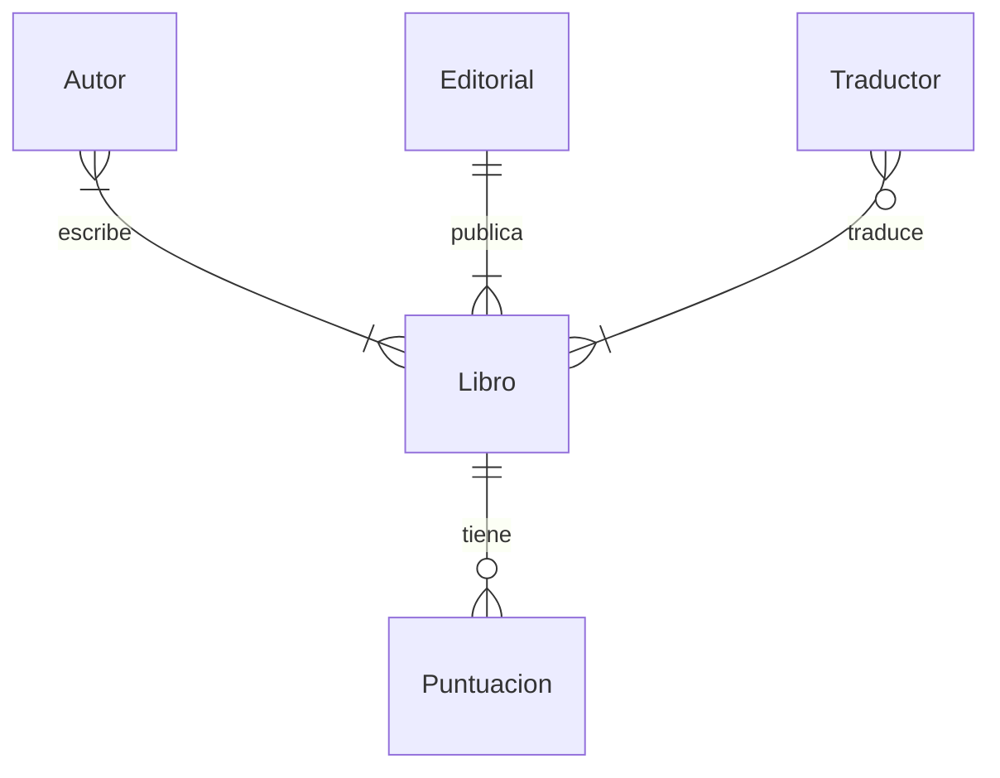

# Clase 1

## Tabla de Contenidos

- [Introduccion](#introduccion)
- [Diagramas Entidad-Relacion](#diagramas-entidad-relacion)
  - [Preguntas](#preguntas)
- [Claves](#claves)
  - [Claves Primarias](#claves-primarias)
  - [Claves Foraneas](#claves-foraneas)
  - [Preguntas](#preguntas-1)
- [Subconsultas](#subconsultas)
- [`IN`](#in)
  - [Preguntas](#preguntas-2)
- [`JOIN`](#join)
  - [Preguntas](#preguntas-3)
- [Conjuntos](#conjuntos)
  - [Preguntas](#preguntas-4)
- [Grupos](#grupos)
  - [Preguntas](#preguntas-5)
- [Fin](#fin)

---

## Introduccion

- Las bases de datos pueden tener multiples tablas. La clase pasada, vimos una base de datos de libros nominados para el International Booker Prize. Ahora veremos que esa base de datos tiene muchas tablas diferentes dentro de ella — para libros, autores, editoriales y demas.
- Primero, abre la base de datos usando psql en la terminal de tu sistema.
- Podemos usar el siguiente comando de psql para ver todas las tablas en nuestra base de datos:

```
\dt
```

Este comando devuelve los nombres de las tablas en `sql_teach` — 10 en total.

- Estas tablas tienen algunas relaciones entre ellas, y por eso llamamos a la base de datos una **base de datos relacional**. Observa la lista de tablas en `sql_teach` e intenta imaginar relaciones entre ellas. Algunos ejemplos son:
  - Los autores escriben libros.
  - Las editoriales publican libros.
  - Los libros son traducidos por traductores.
- Consideremos nuestro primer ejemplo. ¡Aqui hay una instantanea de las tablas `autores` y `libros` con las columnas de nombre de autor y titulo de libro!


- Con solo mirar estas dos columnas, ¿como podemos saber quien escribio cual libro? Incluso si asumimos que cada libro esta alineado junto a su autor, solo mirar la tabla `autores` no nos daria informacion sobre los libros escritos por ese autor.
- Algunas posibles formas de organizar libros y autores son…
  - **el sistema de honor**: la primera fila en la tabla `autores` siempre correspondera a la primera fila en la tabla `libros`. El problema con este sistema es que uno puede cometer un error (agregar un libro pero olvidar agregar su autor correspondiente, o viceversa). Ademas, un autor puede haber escrito mas de un libro o un libro puede ser coescrito por multiples autores.
  - **volver a un enfoque de una sola tabla**: Este enfoque podria resultar en redundancia (duplicacion de datos) si un autor escribe multiples libros o si un libro es coescrito por multiples autores. Abajo hay una instantanea del enfoque de una tabla con algunos datos redundantes.

    

- Despues de considerar estas ideas, parece que tener dos tablas diferentes es el enfoque mas eficiente. Veamos algunas formas diferentes en que las tablas pueden relacionarse entre si en bases de datos relacionales.
- Considera este caso, donde cada autor escribe solo un libro y cada libro es escrito por un autor. Esto se llama una relacion uno a uno.

    

- Por otro lado, si un autor puede escribir multiples libros, la relacion es una relacion uno a muchos.

    

- Aqui vemos otra situacion donde no solo un autor puede escribir multiples libros, sino que los libros tambien pueden ser coescritos por multiples autores. Esta es una relacion muchos a muchos.

    

---

## Diagramas Entidad-Relacion

- Acabamos de describir relaciones uno a uno, uno a muchos y muchos a muchos entre tablas en una base de datos. Es posible visualizar dichas relaciones usando un diagrama entidad-relacion (ER).
- Aqui hay un diagrama ER para las tablas en nuestra base de datos.



- Cada tabla es una entidad en nuestra base de datos. Las relaciones entre las tablas, o entidades, estan representadas por los *verbos* que marcan las lineas que conectan entidades.
- Cada linea en este diagrama esta en notacion de pata de cuervo.
  - La primera linea con un circulo parece un 0 marcado en la linea. Esta linea indica que no hay relaciones.
  - La segunda linea con una linea perpendicular parece un 1 marcado en la linea. Una entidad con esta flecha debe tener al menos una fila relacionada con ella en la otra tabla.
  - La tercera linea, que parece una pata de cuervo, tiene muchas ramas. Esta linea significa que la entidad esta relacionada con muchas filas de otra tabla.

    

- Por ejemplo:
  - Leemos la notacion de izquierda a derecha. Un autor escribe un libro (o, cada autor puede tener un libro asociado con el).

    

  - Ahora, no solo un autor escribe un libro sino que un libro tambien es escrito por un autor.

    

  - Con esta adicion, un autor escribe al menos un libro y un libro es escrito por al menos un autor. Para reformular, un autor podria estar asociado con uno o multiples libros y un libro puede ser escrito por uno o multiples autores.

    

- Revisemos el diagrama ER para nuestra base de datos.


- Al observar las lineas que conectan las entidades Libro y Traductor, podemos decir que los libros no *necesitan* tener un traductor. Podrian tener de cero a muchos traductores. Sin embargo, un traductor en la base de datos traduce al menos un libro, y posiblemente muchos.

### Preguntas

> Si tenemos alguna base de datos, ¿como sabemos las relaciones entre las entidades almacenadas dentro de ella?

- Las relaciones exactas entre entidades dependen realmente del disenador de la base de datos. Por ejemplo, si cada autor puede escribir solo un libro o multiples libros es una decision que se toma al disenar la base de datos. Un diagrama ER puede pensarse como una herramienta para comunicar estas decisiones a alguien que quiera entender la base de datos y las relaciones entre sus entidades.

> Una vez que sabemos que existe una relacion entre ciertas entidades, ¿como implementamos eso en nuestra base de datos?

- Pronto veremos como podemos usar **claves** en SQL para relacionar tablas entre si.

---

## Claves

### Claves Primarias

- En el caso de los libros, cada libro tiene un identificador unico llamado ISBN. En otras palabras, si buscas un libro por su ISBN, solo se encontrara un libro. En terminos de base de datos, el ISBN es una clave primaria — un identificador que es unico para cada elemento en una tabla.

    

- Inspirados por esta idea de un ISBN, ¡podemos imaginar asignar IDs unicos a nuestras editoriales, autores y traductores! Cada uno de estos IDs seria la clave primaria de la tabla a la que pertenece.

### Claves Foraneas

- Las claves tambien ayudan a relacionar tablas en SQL.
- Una clave foranea es una clave primaria tomada de una tabla diferente. Al referenciar la clave primaria de una tabla diferente, ayuda a relacionar las tablas formando un vinculo entre ellas.

    

    Observa como la clave primaria de la tabla `libros` ahora es una columna en la tabla `puntuaciones`. Esto ayuda a formar una relacion uno a muchos entre las dos tablas — un libro con un titulo (encontrado en la tabla `libros`) puede tener multiples puntuaciones (encontradas en la tabla `puntuaciones`).

- El ISBN, como podemos ver, es un identificador largo. Si cada caracter ocupara un byte de memoria, almacenar un solo ISBN (incluyendo los guiones) tomaria 17 bytes de memoria, ¡lo cual es mucho!
- Afortunadamente, no necesariamente tenemos que usar el ISBN como clave primaria. Podemos construir la nuestra usando numeros como 1, 2, 3… y asi sucesivamente siempre que cada libro tenga un numero unico para identificarlo.
- Anteriormente, vimos como implementar la relacion uno a muchos entre las entidades `libros` y `puntuaciones`. Aqui hay un ejemplo de una relacion muchos a muchos.

    

Ahora hay una tabla llamada `autoria` que mapea la clave primaria de `libros` (`libro_id`) a la clave primaria de `autores` (`autor_id`).

### Preguntas

> ¿Pueden los IDs del autor y del libro ser iguales? Por ejemplo, si `autor_id` es 1 y `libro_id` tambien es 1 en la tabla `autoria`, ¿habra una confusion?

- Tablas como `autoria` se llaman tablas de "union" o "juncion". En dichas tablas, generalmente sabemos cual clave primaria es referenciada por cual columna. En este caso, dado que sabemos que la primera columna contiene solo la clave primaria de `autores` y la segunda columna contiene de manera similar solo la clave primaria de `libros`, ¡estaria bien incluso si los valores coincidieran!

> Si tenemos muchas tablas de union como esta, ¿no ocuparia demasiado espacio?

- Si, hay un intercambio aqui. Tablas como estas ocupan mas espacio pero tambien nos permiten tener relaciones muchos a muchos sin redundancias, como vimos antes.

> Al cambiar el ID de un libro o autor, ¿el ID se actualiza en las otras tablas tambien?

- Un ID actualizado aun necesita ser unico. Dado eso, los IDs a menudo se abstraen y raramente los cambiamos.

---

## Subconsultas

- Una subconsulta es una consulta dentro de otra consulta. Tambien se llaman consultas anidadas.
- Considera este ejemplo para una relacion uno a muchos. En la tabla `libros`, tenemos un ID para indicar la editorial, que es una clave foranea tomada de la tabla `editoriales`. Para averiguar los libros publicados por Fitzcarraldo Editions, necesitariamos dos consultas — una para encontrar el `id` de Fitzcarraldo Editions en la tabla `editoriales` y la segunda, para usar este `id` para encontrar todos los libros publicados por Fitzcarraldo Editions. Estas dos consultas se pueden combinar en una usando la idea de una subconsulta.

```sql
SELECT "titulo"
FROM "libros"
WHERE "editorial_id" = (
    SELECT "id"
    FROM "editoriales"
    WHERE "editorial" = 'Fitzcarraldo Editions'
);
```

Observa que:

- La subconsulta esta entre parentesis. La consulta que esta mas adentro de los parentesis se ejecutara primero, seguida por las consultas externas.
- La consulta interna esta indentada. Esto se hace segun las convenciones de estilo para subconsultas, para aumentar la legibilidad.

- Para encontrar todas las puntuaciones del libro In Memory of Memory

```sql
SELECT "puntuacion"
FROM "puntuaciones"
WHERE "libro_id" = (
    SELECT "id"
    FROM "libros"
    WHERE "titulo" = 'In Memory of Memory'
);
```

- Para seleccionar solo la puntuacion promedio de este libro

```sql
SELECT AVG("puntuacion")
FROM "puntuaciones"
WHERE "libro_id" = (
    SELECT "id"
    FROM "libros"
    WHERE "titulo" = 'In Memory of Memory'
);
```

- El siguiente ejemplo es para relaciones muchos a muchos. Para encontrar el/los autor(es) que escribieron el libro Flights, se necesitaria consultar tres tablas: `libros`, `autores` y `autoria`.

```sql
SELECT "nombre"
FROM "autores"
WHERE "id" = (
    SELECT "autor_id"
    FROM "autoria"
    WHERE "libro_id" = (
      SELECT "id"
      FROM "libros"
      WHERE "titulo" = 'Flights'
    )
);
```

La primera consulta que se ejecuta es la mas profundamente anidada — encontrar el ID del libro Flights. Luego, se encuentra el ID del/los autor(es) que escribieron Flights. Por ultimo, esto se usa para recuperar el/los nombre(s) del autor.

---

## `IN`

- Esta palabra clave se usa para verificar si el valor deseado esta *en* una lista o conjunto de valores dado.
- La relacion entre autores y libros es muchos a muchos. Esto significa que es posible que un autor dado haya escrito mas de un libro. Para encontrar los nombres de todos los libros en la base de datos escritos por Fernanda Melchor, usariamos la palabra clave `IN` de la siguiente manera.

```sql
SELECT "titulo"
FROM "libros"
WHERE "id" IN (
    SELECT "libro_id"
    FROM "autoria"
    WHERE "autor_id" = (
        SELECT "id"
        FROM "autores"
        WHERE "nombre" = 'Fernanda Melchor'
    )
);
```

Nota que la consulta mas interna usa `=` y no el operador `IN`. Esto se debe a que esperamos encontrar solo un autor llamado Fernanda Melchor.

### Preguntas

> ¿Que pasa si el valor de una consulta interna no se encuentra?

- En este caso, la consulta interna no devolveria nada, lo que provocaria que la consulta externa tampoco devuelva nada. La consulta externa depende por tanto de los resultados de la consulta interna.

> ¿Es necesario usar cuatro espacios para indentar una subconsulta?

- No. El numero de espacios usados para indentar una subconsulta puede variar, al igual que la longitud de cada linea en la consulta. Pero la idea central detras de dividir consultas e indentar subconsultas es hacerlas legibles.

> ¿Como podemos implementar una relacion muchos a uno entre tablas?

- Considera la situacion en la que un libro es coescrito por multiples autores. Tendriamos una tabla `autoria` con multiples entradas para el mismo `libro_id`. Cada una de estas entradas tendria un `autor_id` diferente. Vale la pena notar que los valores de clave foranea pueden repetirse dentro de una tabla, pero los valores de clave primaria son siempre unicos.

---

## `JOIN`

- Esta palabra clave nos permite combinar dos o mas tablas juntas.
- Para entender como funciona `JOIN`, considera una base de datos de leones marinos y sus patrones de migracion. Aqui hay una instantanea de la base de datos.

    

- Para averiguar que tan lejos viajo el leon marino Spot, o responder preguntas similares sobre cada leon marino, podriamos usar consultas anidadas. Alternativamente, podriamos unir las tablas `leones_marinos` y `migraciones` de tal manera que cada leon marino tambien tenga su informacion correspondiente como una extension de la misma fila.
- Podemos unir las tablas por el ID del leon marino (el factor comun entre las dos tablas) para asegurar que las filas correctas esten alineadas unas contra otras.
- Para unir las tablas:

```sql
SELECT *
FROM "leones_marinos"
JOIN "migraciones" ON "migraciones"."id" = "leones_marinos"."id";
```

Observa que:

- La palabra clave `ON` se usa para especificar que valores coinciden entre las tablas que se estan uniendo. No es posible unir tablas sin valores coincidentes.
- Si hay algun ID en una tabla que no esta presente en la otra, esta fila no estara presente en la tabla unida. Este tipo de union se llama `INNER JOIN`.

- Algunas otras formas de unir tablas que nos permiten retener ciertos IDs no coincidentes son `LEFT JOIN`, `RIGHT JOIN` y `FULL JOIN`. Cada uno de estos es un tipo de `OUTER JOIN`.
- Un `LEFT JOIN` prioriza los datos en la tabla izquierda (o primera).

```sql
SELECT *
FROM "leones_marinos"
LEFT JOIN "migraciones" ON "migraciones"."id" = "leones_marinos"."id";
```

Esta consulta retendria todos los datos de leones marinos de la tabla `leones_marinos` — la izquierda. Algunas filas en la tabla unida podrian estar parcialmente vacias. Esto ocurriria si la tabla derecha no tuviera datos para un ID particular.

- Similarmente, un `RIGHT JOIN` retiene todas las filas de la tabla derecha (o segunda). Un `FULL JOIN` nos permite ver la totalidad de todas las tablas.
- Como podemos observar, un `OUTER JOIN` podria llevar a valores vacios o `NULL` en la tabla unida.
- Ambas tablas en la base de datos de leones marinos tienen la columna `id`. Dado que el valor sobre el cual estamos uniendo las tablas tiene el mismo nombre de columna en ambas tablas, podemos omitir la seccion `ON` de la consulta al unir.

```sql
SELECT *
FROM "leones_marinos"
NATURAL JOIN "migraciones";
```

Nota que el resultado no tiene una columna `id` duplicada en este caso. Ademas, esta union funciona de manera similar a un `INNER JOIN`.

### Preguntas

> En la base de datos de leones marinos, ¿como se crean los IDs? ¿Vienen de la tabla `leones_marinos` o de la tabla `migraciones`?

- El ID de cada leon marino probablemente provino de investigadores que rastrean los patrones de migracion de estos leones marinos. Es decir, los IDs no se generaron en ninguna de las tablas, sino que se asignaron en la fuente de los datos mismos.

> Si estamos tratando de unir tres tablas, ¿como podemos saber cuales son las tablas izquierda o derecha?

- Para cada sentencia `JOIN`, la primera tabla antes de la palabra clave es la izquierda. La que esta involucrada en la palabra clave `JOIN` es la tabla derecha.

> Cuando unimos tablas, ¿la tabla unida resultante se guarda? ¿Podemos referenciarla despues sin unir de nuevo?

- En la forma en que estamos usando `JOIN`, el resultado es una tabla temporal o un conjunto de resultados. Puede usarse durante la duracion de la consulta.

> Hay muchos tipos diferentes de `JOIN`. ¿Hay alguno por defecto que deberiamos usar?

- El tipo mas simple — simplemente `JOIN` — es en realidad un `INNER JOIN` y ese es el predeterminado para SQL.

---

## Conjuntos

- Antes de sumergirnos en conjuntos, necesitaremos volver a la base de datos de libros (`sql_teach`).
- Al ejecutar una consulta, los resultados que vemos se llaman un conjunto de resultados. Este es un tipo de conjunto en SQL.
- Tomemos otro ejemplo. En nuestra base de datos de libros, tenemos autores y traductores. Una persona podria ser autor o traductor. Si los dos conjuntos tienen una interseccion, tambien es posible que una persona pueda ser tanto autor como traductor de libros. Podemos usar el operador `INTERSECT` para encontrar este conjunto.

    

```sql
SELECT "nombre" FROM "traductores"
INTERSECT
SELECT "nombre" FROM "autores";
```

- Si una persona es autor o traductor, o ambos, pertenece a la union de los dos conjuntos. En otras palabras, este conjunto se forma combinando los conjuntos de autor y traductor.

    

```sql
SELECT "nombre" FROM "traductores"
UNION
SELECT "nombre" FROM "autores";
```

¡Observa que cada autor y cada traductor esta incluido en este conjunto de resultados, pero solo una vez!

- Un ajuste menor a la consulta anterior nos da la profesion de la persona en el conjunto de resultados, basado en si son autor o traductor.

```sql
SELECT 'autor' AS "profesion", "nombre"
FROM "autores"
UNION
SELECT 'traductor' AS "profesion", "nombre"
FROM "traductores";
```

- Todos los que son autores y *solo* autores estan incluidos en el siguiente conjunto. La palabra clave `EXCEPT` puede usarse para encontrar dicho conjunto. En otras palabras, el conjunto de traductores se resta del conjunto de autores para formar este.

    

```sql
SELECT "nombre" FROM "autores"
EXCEPT
SELECT "nombre" FROM "traductores";
```

Podemos verificar que ningun autor-traductor del conjunto interseccion aparece en este conjunto de resultados.

- Similarmente, es posible encontrar un conjunto de personas que son solo traductoras usando `EXCEPT`.
- ¿Como podemos encontrar este conjunto de personas que son autores o traductores pero no ambos?

    

- Estos operadores podrian ser utiles para responder muchas preguntas diferentes. Por ejemplo, podemos encontrar los libros que Sophie Hughes y Margaret Jull Costa han traducido juntas.

```sql
SELECT "libro_id" FROM "traduccion"
WHERE "traductor_id" = (
    SELECT "id" FROM "traductores"
    WHERE "nombre" = 'Sophie Hughes'
)
INTERSECT
SELECT "libro_id" FROM "traduccion"
WHERE "traductor_id" = (
    SELECT "id" FROM "traductores"
    WHERE "nombre" = 'Margaret Jull Costa'
);
```

Cada una de las consultas anidadas aqui encuentra los IDs de los libros para un traductor. La palabra clave `INTERSECT` se usa para intersectar los conjuntos resultantes y darnos los libros en los que han colaborado.

### Preguntas

> ¿Podriamos usar `INTERSECT`, `UNION` etc. para realizar operaciones en 3-4 conjuntos?

- Si, absolutamente. Para intersectar 3 conjuntos, tendriamos que usar el operador `INTERSECT` dos veces. Una nota importante — tenemos que asegurarnos de tener el mismo numero y los mismos tipos de columnas en los conjuntos a combinar usando `INTERSECT`, `UNION` etc.

---

## Grupos

- Considera la tabla `puntuaciones`. Para cada libro, queremos encontrar la puntuacion promedio del libro. Para hacer esto, primero necesitariamos agrupar las puntuaciones por libro y luego promediar las puntuaciones para cada libro (cada grupo).

```sql
SELECT "libro_id", AVG("puntuacion") AS "puntuacion promedio"
FROM "puntuaciones"
GROUP BY "libro_id";
```

¡En esta consulta, se uso la palabra clave `GROUP BY` para crear grupos para cada libro y luego colapsar las puntuaciones del grupo en una puntuacion promedio!

- Ahora, solo queremos ver los libros que estan bien valorados, con una puntuacion promedio superior a 4.

```sql
SELECT "libro_id", ROUND(AVG("puntuacion")::numeric, 2) AS "puntuacion promedio"
FROM "puntuaciones"
GROUP BY "libro_id"
HAVING AVG("puntuacion") > 4.0;
```

Nota que la palabra clave `HAVING` se usa aqui para especificar una condicion para los grupos, en lugar de `WHERE` (que solo puede usarse para especificar condiciones para filas individuales).

### Preguntas

> ¿Es posible ver el numero de puntuaciones dadas a cada libro?

- Si, esto requeriria una ligera modificacion con el uso de la palabra clave `COUNT`.

```sql
SELECT "libro_id", COUNT("puntuacion")
FROM "puntuaciones"
GROUP BY "libro_id";
```

> ¿Tambien es posible ordenar los datos obtenidos aqui?

- Si, lo es. Digamos que quisieramos encontrar las puntuaciones promedio por libro bien valorado, ordenadas en orden descendente.

```sql
SELECT "libro_id", ROUND(AVG("puntuacion")::numeric, 2) AS "puntuacion promedio"
FROM "puntuaciones"
GROUP BY "libro_id"
HAVING AVG("puntuacion") > 4.0
ORDER BY "puntuacion promedio" DESC;
```

---

## Fin

- ¡Esto nos lleva a la conclusion de la Clase 1 sobre Relaciones (Relating) en SQL! Para salir del prompt de psql, puedes escribir `\q` y esto te llevara de vuelta a la terminal regular.
- ¡Hasta la proxima vez!

---

**Fuente:** CS50 SQL - Lecture 1: Relating. Harvard University. https://cs50.harvard.edu/sql/notes/1/

Este material esta disponible bajo la licencia Creative Commons Attribution-NonCommercial-ShareAlike 4.0 International (CC BY-NC-SA 4.0).
